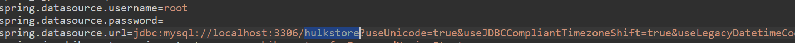

# Prueba de Concepto Todo1 - Anderson Vargas

 Para satisfacer las necesidades de esta prueba de concepto este proyecto se desarrollo en *JAVA* utilizando [Spring FrameWork](https://spring.io/), uno de los frameWorks más robustos de JAVA.
 Partiendo de uno de los requisitos plateados: "Desarrollo de interfaces básicas para el procesamiento de la información.", se desarrollaron las interfaces
 dentro del mismo proyecto haciendo uso de la biblioteca [Thymeleaf](https://www.thymeleaf.org/)

---

# Contenido

1) Los modelos en base de datos se generan automaticamente al ejecutar el proyecto por primera vez, acontinuación se presenta el respectivo diagrama de clases:
	
	
	
	
	**NOTA:** Se debe crear manualmente una base de datos llamada **hulkstore** necesaria para la ejecución del proyecto, y tenga en cuenta que el proyecto se conecta en el siguiente end-point y crendeciales:
	
	
	

2) Se toma como  base el método de promedio ponderado para el control de inventarios, vea más [aquí](https://actualicese.com/metodo-del-promedio-ponderado-para-el-control-de-inventarios/)

3) Acontinuación se muestra la tabla de lo que sería un registro Kardex por promedio ponderado:

	
	

	Y lo que seria una tabla resultante de un software kardex:

	

4) Para realizar adiciones a los registros de su kardex usted podra: Crear un nuevo producto, Ingresar más unidades a ese producto, Vender unidades de ese producto y además podra visualizar cada uno de los movimientos que tiene asociados.
	
	
	
5) Una tabla del kardex en nuestro sistema tendra la siguiente estructura:
	
	
	
	Cada uno de los items de esa estructura significan:

   **Fecha:** fecha en la que se realizo la operación

   **Tipo:** Buy(si se estan ingresando productos al sistema), Sale(si se esta realizando una venta de productos), Existencia(primer registro con los datos iniciales de un producto).

   **Stock Operación**: Corresponse a la cantidad que se esta manipulando en esa operación(ej: si esta vendiendo 4 articulos, el **Stock Operación** será igual a 4).

   **Precio Unitario Operacion:** Corresponse al precio unitario del articulo que se esta manipulando en esa operación(ej: si esta vendiendo un articulo cuyo precio unitario es 10, el **Precio Unitario Operacion:** será igual a 10).

   **Precio Total Operación:** Corresponde al producto de **Precio Unitario Operacion** * **Stock Operación**.

   **Stock Inventario**: Corresponse al numero de unidades total que se tiene registrada de ese articulo.

   **Precio Unitario Inventario:** Corresponse precio unitario del articulo como tal, se calcula solo cuando hay un ingreso de productos. 
	
   Formula:	
   

   **Precio Total Inventario:** Corresponde al producto de **Precio Unitario Inevntario** * **Stock Inventario**

   **Número de Factura:** Corresponse al numero de la factura asociada a ese movimiento.
   
6) Para realizar la ejecución del proyecto usted puede:

    **1.** Ejecutar el proyecto desde su IDE
    **2.** Instalar [Apache Maven](https://maven.apache.org/install.html) y estando en la raiz del proyecto, ejecutar **mvn spring-boot:run**  
	
	**Listo**, el proyecto debe estar corriendo en http://localhost:8080/

7) Para realizar la ejecución de las pruebas unitarias:

    **1.** Ejecutar el proyecto desde su IDE, como ejemplo se muestra en eclipse:
	
	 
	
    **2.** Instalar [Apache Maven](https://maven.apache.org/install.html) y estando en la raiz del proyecto, ejecutar **mvn test** 